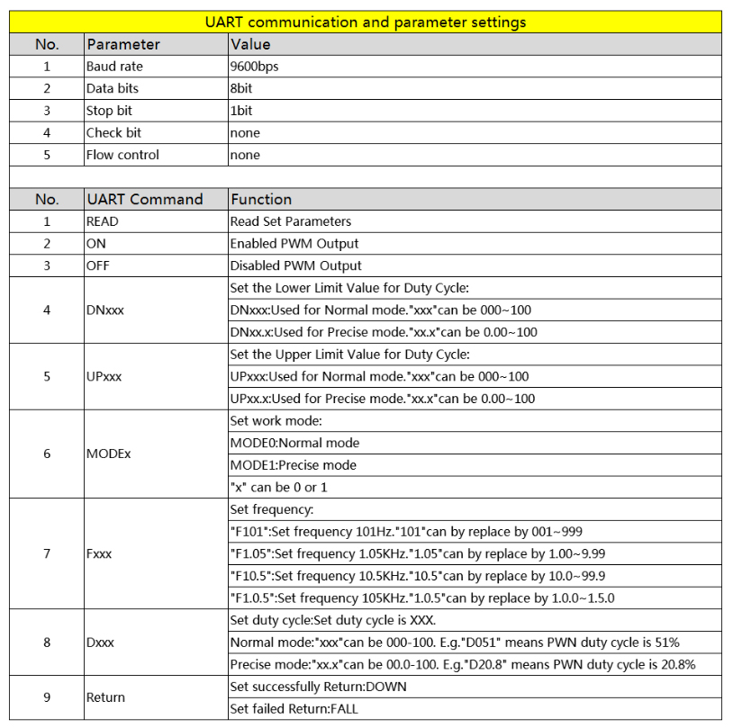

# XY-LPWM_COM

一个用WPF写的简易`XY-LPWM`PWM模块上位机，可以控制频率与占空比，串口连接。Release已打包 dotnet framwork 6.0。

参考这个文档写的串口（忘记哪里找的了，好像是StackOverflow）：

*1. UART parameter setting: TTL 9600, N, 8, 1*

*2. Set PWM frequency:*

> 'F101' :Set frequency is 101Hz.' 101' can by replace by 001~999;
>
> 'F1.05' :Set frequency is 1.05KHz.' 1.05' can by replace by 1.00~9.99;
>
> 'F10.5' :Set frequency is 10.5KHz.' 10.5' can by replace by 10.0~99.9;
>
> 'F1.0.5' :Set frequency is 105KHz.' 1.0.5' can by replace by 1.0.0~1.5.0;

*3. Set PWM duty cycle:*

> 'DXXX': Set duty cycle is XXX. ' XXX' can be 000-100.
>
> Example: 'D051' means PWN duty cycle is be set as 51%.

*4. Read set parameter:*

> Send 'read' and then get parameter.

*5. Return value:*

> Returns 'DOWN': Set success.
>
> Returns 'FALL': Set fail.

